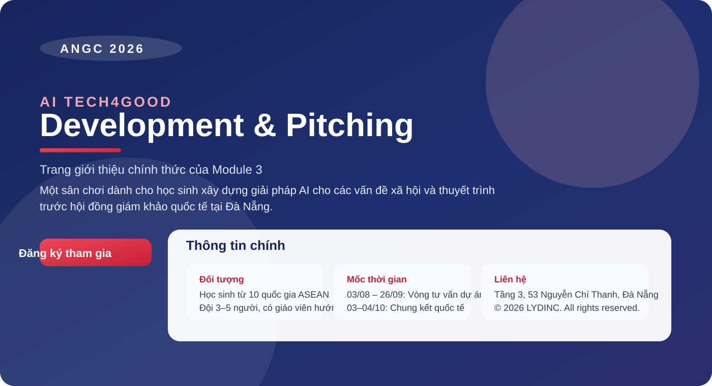

# AI Tech4Good — Development & Pitching · ANGC 2026

Trang giới thiệu chính thức của Module 3: AI Tech4Good – Development & Pitching, thuộc khuôn khổ Asian Next Generation Citizen Competition (ANGC) 2026.



## Website này là gì?

Đây là landing page giới thiệu một cuộc thi công nghệ dành cho học sinh, nơi các đội thi xây dựng giải pháp ứng dụng AI cho các vấn đề xã hội thực tế và thuyết trình trước hội đồng giám khảo quốc tế tại Đà Nẵng, Việt Nam.

### Điểm nổi bật

- Giới thiệu cuộc thi và vai trò của MARS Academy (Malaysia)
- Đồng hồ đếm ngược tới vòng chung kết quốc tế
- Giá trị học tập và trải nghiệm dành cho học sinh
- Thể lệ thi đấu theo 2 vòng: tư vấn dự án và thuyết trình
- 3 nhóm tuổi: THCS, THPT, Đại học
- Tiêu chí chấm điểm, giải thưởng và lịch trình mùa thi 2026
- Thông tin đăng ký và liên hệ

## Đối tượng tham gia

Học sinh đến từ 10 quốc gia Đông Nam Á trong khuôn khổ ICode4Good ASEAN 10-Nations League. Mỗi đội gồm 3–5 học sinh và có 1–2 giáo viên/mentor hướng dẫn.

## Mốc thời gian chính

| Giai đoạn | Thời gian |
|---|---|
| Vòng tư vấn dự án | 03/08 – 26/09/2026 |
| Tổng duyệt thuyết trình | 27/09/2026 |
| Chung kết quốc tế tại Đà Nẵng | 03 – 04/10/2026 |

## Liên hệ & đăng ký

- Đăng ký tham gia: nút Register trên trang chủ
- Văn phòng: Tầng 3, 53 Nguyễn Chí Thanh, Đà Nẵng

---

© 2026 LYDINC. All rights reserved.

## Chạy website

Không cần cài đặt thư viện hoặc framework. Mở trực tiếp file index.html bằng trình duyệt.

Nếu muốn chạy bằng máy chủ cục bộ:

```powershell
python -m http.server 8080
```

Sau đó truy cập http://127.0.0.1:8080.
